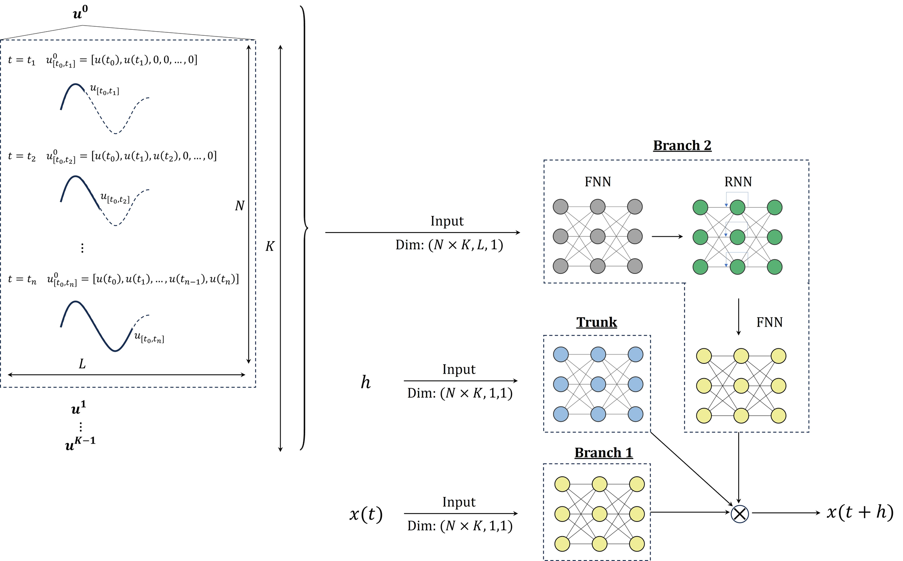
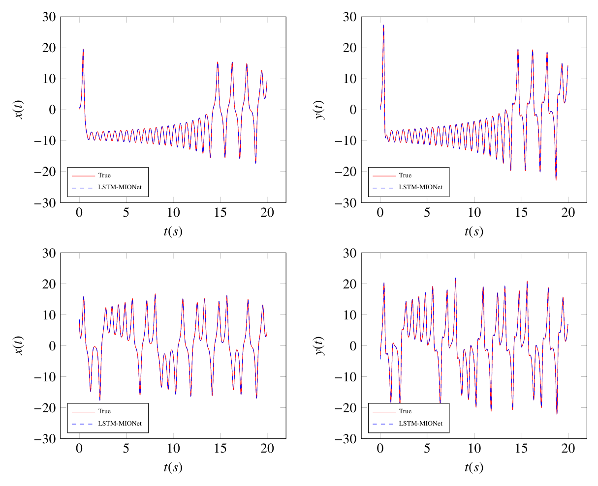
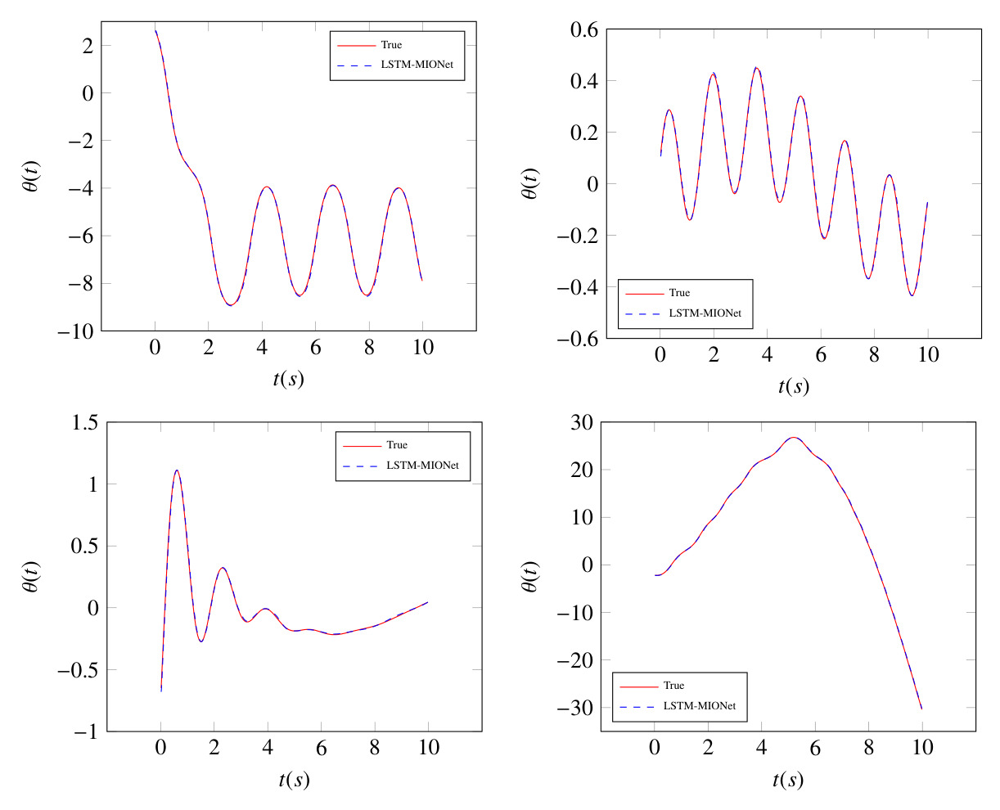
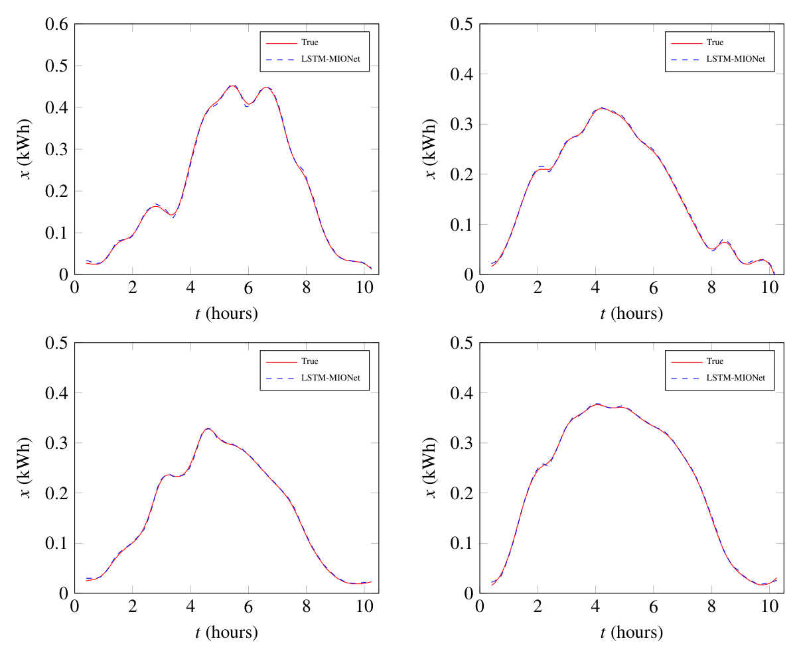
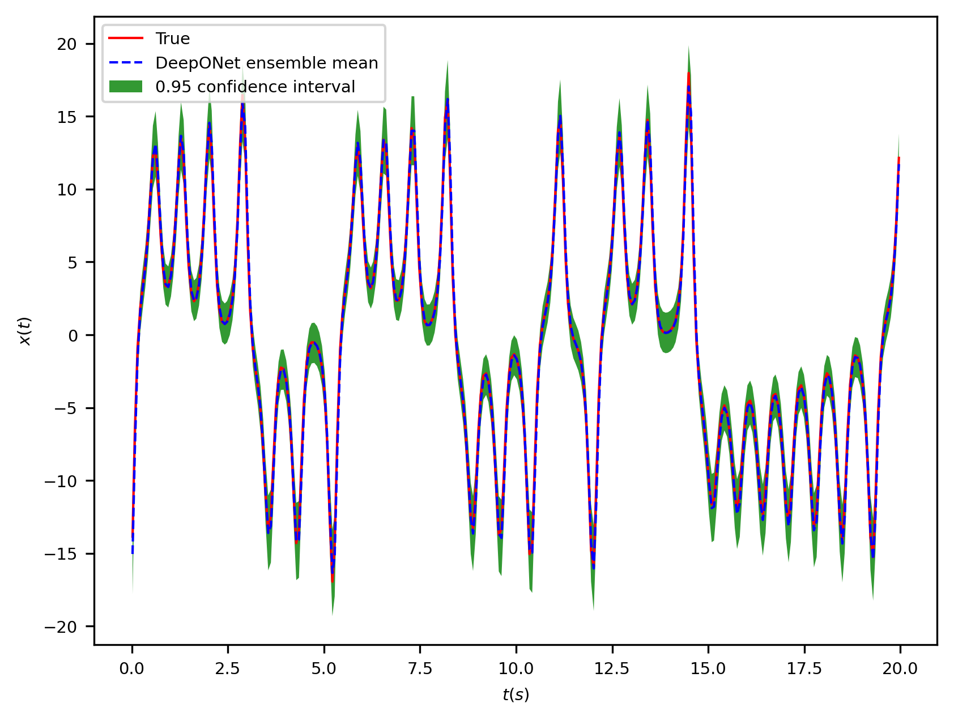
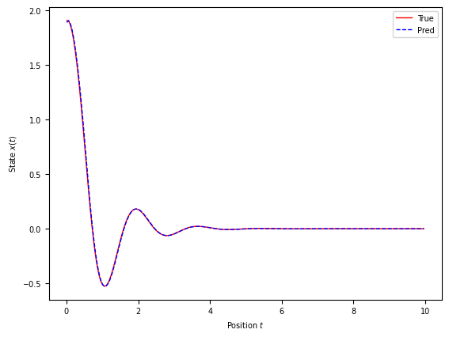

# B-LSTM-MIONet: Bayesian LSTM-based Neural Operators for Learning the Response of Complex Dynamical Systems to Length-Variant Multiple Input Functions

Operator learning for dynamical systems whose input history keeps growing: an LSTM branch reads a
variable-length, real-time input, and a replica-exchange SGLD ensemble puts a confidence interval on
every prediction.

[](https://arxiv.org/abs/2311.16519)
[](https://github.com/moodykong/bayesian-lstm-mionet/actions/workflows/ci.yml)
[](LICENSE)
[](https://www.python.org/downloads/)
[](https://github.com/astral-sh/uv)
[](https://github.com/psf/black)

Zhihao Kong, Amirhossein Mollaali, Christian Moya, Na Lu, Guang Lin — Purdue University
(Lyles School of Civil Engineering; School of Mechanical Engineering; Department of Mathematics).
Corresponding author: Guang Lin. Paper: [arXiv:2311.16519](https://arxiv.org/abs/2311.16519) (v2, 29 Nov 2023).

## Abstract in short

DeepONet and MIONet learn solution operators of dynamical systems, but they need the whole input
function, discretised on a fixed grid, before they can predict anything — which rules out real-time
use, where the available history grows with time. LSTM-MIONet replaces the offline branch net with an
FNN-LSTM-FNN branch that consumes a masked, variable-length history of the input function (or of the
state, for autonomous systems), and learns the *local* operator mapping the current state and that
history to the state one step size later. B-LSTM-MIONet then samples the posterior over network
parameters with replica-exchange stochastic gradient Langevin dynamics (reSGLD), so an M-member
ensemble yields a predictive mean, a standard deviation and a 95% confidence interval instead of a
single point estimate. The method is evaluated on the chaotic Lorentz 63 system, a pendulum swing-up
driven by a Gaussian random field, and real rooftop PV generation from the Ausgrid dataset.

## Method



**Figure 3 of the paper.** Branch 1 is an FNN over the current state `x(t)`. Branch 2 is the
FNN-LSTM-FNN sandwich that encodes the masked history `u_(t0,t]` of the input function — or the state
history `x_(t0,t]` when the system is autonomous — into a single memory vector. The Trunk is an FNN
over the scalar step size `h(t)`. The three feature vectors are fused by an element-wise dot product,
equation (4) of the paper:

```
F(x(t), u_(t0,t])(h(t)) = sum_i b_i * beta_i * phi_i = x(t + h(t))
```

with `b` from Branch 1, `beta` from Branch 2 and `phi` from the Trunk. Because the history enters
through an LSTM over a masked sequence, the same trained model accepts inputs of any length up to the
training horizon, and the evaluation points `t` need not be equispaced.

## Highlights

- **Variable-length, real-time inputs.** Random masks `T_(t0,t]` turn each recorded full-length
  trajectory into many sub-sequences of every length ([`data/masking.py`](src/blstm_mionet/data/masking.py)).
- **Local operator formulation.** The network predicts `x(t + h)` from `(x(t), history, h)` rather
  than a whole trajectory, which keeps temporal causality and allows arbitrary query spacings.
- **Extrapolation.** Trained on `t` in `[0, 10] s`, the pendulum model stays below 0.58% L2 relative
  error up to `T = 12 s`, i.e. 120% of the training horizon.
- **Bayesian UQ with replica-exchange SGLD.** Two Langevin chains at different temperatures swap
  states; after burn-in the low-temperature chain is sampled into an M-member posterior ensemble
  ([`training/resgld.py`](src/blstm_mionet/training/resgld.py)).
- **Three benchmarks.** Autonomous Lorentz 63, non-autonomous pendulum swing-up, and Ausgrid rooftop
  PV generation — one YAML config and one reproduce script each.

## Results

Deterministic LSTM-MIONet, mean L2 relative error over the test trajectories, and the reSGLD ensemble
(M = 300) with its prediction interval coverage probability (PICP):

| Experiment | Test setting | LSTM-MIONet L2 | Bayesian L2 | PICP | Paper |
| --- | --- | --- | --- | --- | --- |
| Lorentz 63, `x(t)` | 100 initial conditions, `h = 0.01 s`, `T = 20 s` | **1.29%** | 5.83% | 100% | Tables 1, 2 |
| Lorentz 63, `y(t)` | same | **1.13%** | 8.33% | 97% | Tables 1, 2 |
| Pendulum, `theta(t)` | in distribution, `u` from a Gaussian random field | **2.02%** | 3.34% | 100% | Tables 3, 4 |
| Pendulum, `theta(t)` | out of distribution, `u = sin(t/2)` | **2.88%** | — | — | Table 3 |
| Ausgrid PV, `x(t)` | customers 51-60, one year | **1.23%** | — | — | Table 5 |
| Ausgrid PV, `x(t)` | customers 61-70, one year | **1.33%** | — | — | Table 5 |

Baselines from Section 5.1: on the pendulum, local DeepONet reaches 2.04% against 2.02% for
LSTM-MIONet (Table 6); on the chaotic Lorentz system, a vanilla DeepONet — which sees no history —
reaches 5.23% against 1.29% (Table 7). Section 5.2 adds the temporal studies: the error stays below
0.58% up to 120% of the training horizon (Figure 9) and grows linearly with the step size for `h` in
`[0.02, 0.50] s` (Figure 10).

<p align="center">
  
  
  
  <br />
  <em>Figures 4, 6 and 8: prediction vs. ground truth for the Lorentz 63 states <code>x(t)</code> and
  <code>y(t)</code>, the pendulum angle <code>theta(t)</code> under four control functions, and the
  gross PV generation <code>x(t)</code> of individual Ausgrid customers.</em>
</p>

<p align="center">
  
  
  <br />
  <em>Left, Figure 5: the 0.95 confidence interval of the B-LSTM-MIONet ensemble on the Lorentz
  problem — the true trajectory stays inside it (PICP 100%). Right: out-of-distribution
  generalisation on the pendulum, driven by <code>u = sin(t/2)</code>, an input never seen during
  training; reproduced by <a href="notebooks/02_pendulum.ipynb">notebooks/02_pendulum.ipynb</a>.</em>
</p>

All 25 figures, with their provenance, are inventoried in [`assets/README.md`](assets/README.md).

## Installation

Python 3.10 or newer is required; [`.python-version`](.python-version) pins 3.10 for uv, so `uv sync`
creates a 3.10 environment without any extra flag. PyTorch is selected through three mutually
exclusive extras, because the CPU and CUDA wheels come from different indexes: `cpu` pulls the small
CPU-only wheel, `cu126` the CUDA 12.6 build and `cu130` the CUDA 13.0 build. Pick exactly one.

```bash
git clone https://github.com/moodykong/bayesian-lstm-mionet.git
cd bayesian-lstm-mionet
uv sync --extra cpu      # or: uv sync --extra cu126 / uv sync --extra cu130
uv run blstm-mionet --help
```

`uv sync` also installs the `dev` dependency group (pytest, ruff, black, pre-commit) by default. Add
`--group notebooks` for Jupyter.

Plain pip works too, in which case torch is resolved from PyPI rather than from the PyTorch index:

```bash
python -m venv .venv && source .venv/bin/activate
pip install -e ".[cpu]"
```

## Quickstart

A five-minute, CPU-only tour on a deliberately tiny Lorentz dataset. Run it from the repository root:
paths inside a config are relative to the working directory, so `data/`, `mlruns/` and `figures/` are
created next to you (all three are git-ignored).

```bash
# 1. 20 trajectories of 2 s instead of the 5000 x 20 s of the paper
uv run blstm-mionet generate --config configs/lorentz.yaml \
    --n-sample 20 --set data.t_max=2.0 --output data/lorentz_demo.npy

# 2. two epochs of Adam; writes an MLflow run under mlruns/
uv run blstm-mionet train --config configs/lorentz.yaml \
    --data data/lorentz_demo.npy --epochs 2 --device cpu

# 3. single-step evaluation of that model; substitute the run id printed by step 2
uv run blstm-mionet infer --config configs/lorentz.yaml \
    --data data/lorentz_demo.npy --model runs:/<run id>/model \
    --set inference.search_num=20 --device cpu

# 4. the Bayesian path: reSGLD with a 3-member ensemble
uv run blstm-mionet train --config configs/lorentz.yaml \
    --bayesian configs/bayesian/lorentz.yaml --data data/lorentz_demo.npy \
    --epochs 8 --set bayesian.n_ensemble=3 --device cpu

# 5. posterior predictive mean, standard deviation and coverage
uv run blstm-mionet infer-bayesian --config configs/lorentz.yaml \
    --data data/lorentz_demo.npy --run runs:/<run id> --device cpu

# 6. browse the runs
MLFLOW_ALLOW_FILE_STORE=true uv run mlflow ui --backend-store-uri mlruns
```

1. Prints a progress bar and `Data saved in data/lorentz_demo.npy.`
2. Prints the training bar and a held-out error table, saves a figure under `figures/`, and ends with
   the identifiers you need next:

   ```
   MLflow run id: 8c6d9f5f8f8d48048fd7dea4927c3e51
   MLflow run uri: runs:/8c6d9f5f8f8d48048fd7dea4927c3e51
   Model uri: models:/m-64fd01d74b5740ebae6f16fc0832768a
   Model uri (run scoped): runs:/8c6d9f5f8f8d48048fd7dea4927c3e51/model
   ```

   It also registers a model version named after `training.registered_model_name` (`lorentz` here),
   so `models:/lorentz/latest` resolves to it afterwards.
3. Prints `Loading model from runs:/<run id>/model`, the L1 and L2 error tables, `Figure saved to
   figures/infer_trajs_0.png.` and a summary line, `L2-relative error: mean = 46.4144 %, st. dev. =
   12.2011 % over 20 trajectories`. Two epochs on 20 trajectories is a smoke test, not a result.
4. Prints `Collecting up to 3 ensemble members after epoch 4.` (the burn-in is
   `epochs - (n_ensemble + 1)`), a bar showing both chains and whether they swapped, and `Logged 3
   ensemble members to runs:/<run id>/ensemble`.
5. Prints `Found 3 ensemble members in ...`, four error tables (ensemble mean and posterior sample),
   `Figure saved to figures/uq_trajs_0.png.`, and the two UQ lines `Ensemble prediction: mean std of
   the posterior = ..., mean |mean - truth| = ...` and `PICP (95% interval) = ...`.
6. Serves the MLflow UI on http://127.0.0.1:5000 (`--port` changes it). MLflow 3 refuses a file store unless
   `MLFLOW_ALLOW_FILE_STORE=true` is set; the `blstm-mionet` commands set it for you, the bare
   `mlflow` CLI does not.

## Reproducing the paper

Every experiment is one YAML file plus one script; the scripts accept `--device` and a `--quick` flag
that shrinks the run to a CPU demo. The paper-scale settings below take hours on a GPU and were
**not** executed to produce this README.

### Lorentz 63 (Sec. 4.1)

[`configs/lorentz.yaml`](configs/lorentz.yaml), [`scripts/reproduce_lorentz.sh`](scripts/reproduce_lorentz.sh).
5000 initial conditions from `X0 = [-17, 20] x [-23, 28] x [0, 50]`, RK-4 at `Δ = 0.01 s` over
`T = 20 s`; each trajectory replicated 4 times (`search_num: 4`) with `h_max = 0.02 s`
(`search_len: 2`), giving `N_train = 20000`; Adam for up to 1000 epochs with early stopping after 80.
The system is autonomous, so Branch 2 reads the state history (`data.control: null`,
`inference.autonomous: true`). Hours on one GPU.

### Pendulum swing-up (Sec. 4.2)

[`configs/pendulum.yaml`](configs/pendulum.yaml), [`scripts/reproduce_pendulum.sh`](scripts/reproduce_pendulum.sh).
5000 initial conditions from `theta in [-pi, pi]`, `theta_dot in [-8, 8]` and 5000 control functions
drawn from a Gaussian random field with RBF kernel length 0.01 (`data.control: gaussian`); RK-4 at
`Δ = 0.01 s` over `T = 10 s`; each control replicated 10 times, `N_train = 50000`. For the
out-of-distribution test of Table 3, regenerate the test set with `--set data.control=designate`,
which uses `u = sin(t/2)`. Hours on one GPU.

### Ausgrid PV generation (Sec. 4.3)

[`configs/ausgrid.yaml`](configs/ausgrid.yaml), [`scripts/reproduce_ausgrid.sh`](scripts/reproduce_ausgrid.sh).
Gross generation (`category: GG`) of customers 1-50 between 2010-07-01 and 2011-06-30, the 21
half-hour readings from 07:00 to 17:00 (CSV columns 18-38), interpolated to `h = 0.05 hours`; `search_len: 10` gives
`h_max = 0.5 hours` and `search_num: 5` gives `N_train = 91500` daily sub-sequences. Testing uses
customers 51-60 and 61-70. Needs the licensed CSV files, see below. Hours on one GPU.

### Bayesian ensembles (Sec. 3.5)

Add `--bayesian configs/bayesian/<experiment>.yaml` to `train` and the optimiser switches from Adam
to replica-exchange SGLD: an *exploit* chain at low temperature and an *explore* chain at twice that
temperature, swapping after every epoch. Members are collected once per epoch after the burn-in
`epochs - (n_ensemble + 1)`; the shipped files use `n_ensemble: 360` (400 epochs, 40 burn-in) and the
paper evaluates M = 300 of them. Evaluate with `infer-bayesian --run runs:/<run id>`, or run
[`scripts/reproduce_bayesian.sh`](scripts/reproduce_bayesian.sh) `{lorentz|pendulum|ausgrid}`.
A reSGLD run registers its best exploit-chain snapshot under `<registered_model_name>-bayesian`
(for example `lorentz-bayesian`), so `models:/lorentz/latest` keeps pointing at the Adam model.

Two fixes since the paper change Bayesian results: the Langevin noise is now drawn independently
for every parameter entry (the research code used one scalar per tensor), and the posterior
predictive sample uses the ensemble standard deviation. A rerun therefore will not reproduce the
published ensembles bit for bit; the deterministic LSTM-MIONet path is unchanged. See
[CHANGELOG.md](CHANGELOG.md).

### Pretrained models and data

A OneDrive archive holds both the Ausgrid selection and the `mlruns` folder of the paper, with the
registered models `lorentz`, `pendulum` and `Ausgrid`:
[download](https://1drv.ms/f/c/d5114f16b2467d66/ErohO9kQs3dEtu44wJrjXwMBcGFycoc8kBF6evk4bMvxhw?e=LStcCz).
[`scripts/download_data.sh`](scripts/download_data.sh) is the scripted entry point.

Unpack `mlruns` at the repository root (or leave it anywhere and point `MLFLOW_TRACKING_URI` at it —
the environment variable wins over `tracking.uri` in the YAML). Registered-model URIs then work
directly:

```bash
uv run blstm-mionet infer --config configs/lorentz.yaml \
    --data data/lorentz_N_100_h001_T20.npy --model models:/lorentz/latest --device cpu
```

The Ausgrid CSV files are licensed by Ausgrid and are not redistributed here; the original source is
[Solar home electricity data](https://www.ausgrid.com.au/Industry/Our-Research/Data-to-share/Solar-home-electricity-data).
`data.ausgrid.csv_paths` in [`configs/ausgrid.yaml`](configs/ausgrid.yaml) expects the three released
files, by default at:

```
data/Ausgrid/Solar home half-hour data - 1 July 2010 to 30 June 2011/2010-2011 Solar home electricity data.csv
data/Ausgrid/Solar home half-hour data - 1 July 2011 to 30 June 2012/2011-2012 Solar home electricity data v2.csv
data/Ausgrid/Solar home half-hour data - 1 July 2012 to 30 June 2013/2012-2013 Solar home electricity data v2.csv
```

Any other location works — override the list rather than moving files:
`--set data.ausgrid.csv_paths='[/data/ausgrid/2010-2011.csv]'`.

## Configuration

One YAML file per experiment, with five sections: `data` (system, horizon, step size, sample count,
Ausgrid selection), `model` (architecture and the widths/depths of the two branches and the trunk),
`training` (sub-sequence sampling, optimiser, early stopping, MLflow experiment and run names),
`inference` (test file, model URI, recursive rollout, ensemble size, figures) and `tracking` (the
MLflow URI). The reSGLD hyper-parameters live in a separate file merged under `bayesian`.

Any entry can be overridden with `--set dotted.key=value`, repeated as often as needed; the value is
parsed as YAML, so numbers, `true`, `null` and inline lists all work:

```bash
uv run blstm-mionet generate --config configs/lorentz.yaml --set data.t_max=2.0
uv run blstm-mionet infer --config configs/lorentz.yaml --set inference.search_num=20
```

Paths inside a config (`data.output`, `training.datafile`, `inference.figure_dir`, `tracking.uri`,
the Ausgrid CSVs) are relative to the directory you run the command from; the package never changes
the working directory.

## Repository layout

```
src/blstm_mionet/
  cli/            generate | train | infer | infer-bayesian sub-commands
  config.py       typed dataclasses, YAML loading and --set overrides
  data/           systems.py (vector fields), generate.py (RK-4), masking.py,
                  datasets.py (torch wrappers), ausgrid.py (CSV selection)
  models/         lstm_mionet.py, deeponet.py, baselines.py, layers.py, registry
  training/       trainer.py (Adam), resgld.py (replica exchange SGLD), tracking.py (MLflow)
  evaluation/     evaluate.py (single step, recursive, ensemble), metrics.py, plotting.py
  utils/          device.py, seed.py, math.py
configs/          one YAML per experiment; bayesian/ holds the reSGLD settings
scripts/          reproduce_*.sh, smoke_test.sh, download_data.sh
notebooks/        annotated walkthroughs of the three experiments plus UQ
tests/            pytest suite
assets/           figures used by this README (paper/ and results/)
```

| Paper section | Module |
| --- | --- |
| Sec. 3.3, LSTM-MIONet | [`models/lstm_mionet.py`](src/blstm_mionet/models/lstm_mionet.py) |
| Sec. 3.4, masking and data generation | [`data/masking.py`](src/blstm_mionet/data/masking.py) |
| Sec. 3.5, Bayesian UQ with reSGLD | [`training/resgld.py`](src/blstm_mionet/training/resgld.py) |
| Sec. 4.1-4.3, the three experiments | [`configs/`](configs/) + [`scripts/`](scripts/) |
| Sec. 5.1, baselines | [`models/deeponet.py`](src/blstm_mionet/models/deeponet.py), [`models/baselines.py`](src/blstm_mionet/models/baselines.py) |

## Notebooks

```bash
uv sync --extra cpu --group notebooks
uv run jupyter lab notebooks/
```

- [`notebooks/01_lorentz.ipynb`](notebooks/01_lorentz.ipynb) — autonomous Lorentz 63, including the
  recursive rollouts at different teacher-forcing probabilities.
- [`notebooks/02_pendulum.ipynb`](notebooks/02_pendulum.ipynb) — non-autonomous pendulum, Gaussian
  random field controls and the `u = sin(t/2)` out-of-distribution test.
- [`notebooks/03_ausgrid.ipynb`](notebooks/03_ausgrid.ipynb) — the Ausgrid PV experiment end to end.
- [`notebooks/04_uncertainty.ipynb`](notebooks/04_uncertainty.ipynb) — reSGLD training, the posterior
  ensemble, confidence intervals and PICP.
- [`notebooks/README.md`](notebooks/README.md) — what each notebook expects on disk.

## Development

```bash
uv sync --extra cpu
uv run pytest
uv run ruff check src tests
uv run black --check src tests
uv run pre-commit install
```

Contributions are welcome — see [CONTRIBUTING.md](CONTRIBUTING.md). Notable changes, including
the ones that alter results relative to the paper's code, are listed in [CHANGELOG.md](CHANGELOG.md).

## Citation

```bibtex
@misc{kong2023blstmmionet,
  title         = {B-LSTM-MIONet: Bayesian LSTM-based Neural Operators for Learning
                   the Response of Complex Dynamical Systems to Length-Variant
                   Multiple Input Functions},
  author        = {Kong, Zhihao and Mollaali, Amirhossein and Moya, Christian and
                   Lu, Na and Lin, Guang},
  year          = {2023},
  eprint        = {2311.16519},
  archivePrefix = {arXiv},
  primaryClass  = {cs.LG}
}
```

Machine-readable metadata for the software and the paper is in [`CITATION.cff`](CITATION.cff).

## Acknowledgments

Guang Lin, Na Lu, Christian Moya and Amirhossein Mollaali gratefully acknowledge the support of the
National Science Foundation (DMS-2053746, DMS-2134209, ECCS-2328241 and OAC-2311848), the U.S.
Department of Energy (DOE) Office of Science Advanced Scientific Computing Research program
(DE-SC0021142, DE-SC0023161), the Uncertainty Quantification for Multifidelity Operator Learning
(MOLUcQ) project (Project No. 81739), and DOE Fusion Energy Science (DE-SC0024583).

## License

MIT — see [LICENSE](LICENSE).
